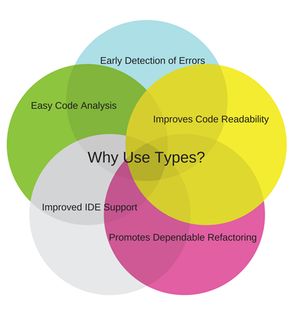

react-native 로 프로젝트를 생성하면 아래와 같은 코드가 등장한다
``` javascript
const App: () => React$Node = () => {
  return ();
};
```

`() => React$Node` 는 타입스크립트문법과 매우 유사하다. `React$Node` 라는 단어만 빼면, 아마 typescript 로 착각했을 정도이다. 도대체 이것은 무엇인지 궁금증이 생기지 않을 수 없었다.

검색을 통해 나와 비슷한 질문의 찾았다 
https://stackoverflow.com/questions/58276469/const-app-reactnode-what-does-it-mean-this-instruction
> "Its type definition from Flow"

... Flow?

## Flow
[Flow] 는 자바스크립트의 스태틱타입체커이다. Facebook 에서 React 프론트엔드 개발을 돕기위해 만든 모듈이다. (참고로 typescript 는 마이크로소프트에서 만든 것이다)

### Installation
일단 flow 를 쓰려면 babel 과 같이 사용하여야 한다.
일반 javascript 컴파일러 (nodejs, 브라우저, 등등) 들은 type annoation 을 컴파일 오류로 인식한다. 따라서 babel 로 한번 이들을 제거해줄 필요가 있다.
``` bash
npm install --save-dev @babel/core @babel/cli @babel/preset-flow
```
인스톨이 끝난후에 .babelrc 에 preset-flow 를 추가한다.
``` json
{
  "presets": ["@babel/preset-flow"]
}
```

이후에 package.json 에 빌드프로세스를 추가한다

``` json
  "scripts": {
    "build": "babel src/ -d lib/",
    "prepublish": "npm run build"
  }
```

### Usage

Flow 는 일단 실행되면 파일들을 모니터링하고 있다가, 에러가 감지되면 출력을 하게 된다.
```
test.js:5
  5:     return x;
                ^ number. This type is incompatible with the expected return type of
  3: function foo(x: ?number): string {
                               ^^^^^^ string
```

일반적인 사용방법은 다음과 같다.,
+ `flow init` 으로 프로젝트에 flow 를 초기화한다
+ flow 를 실행한다
+ ` // @flow` 를 사용하면 flow 파일을 모니터링하게 된다
+ 코드를 작성한다
+ 타입체킹을 통해 에러를 확인한다

참고로 vs code 사용자는 [익스텐션](https://flow.org/en/docs/editors/vscode/) 을 쓰면 된다 (~~그냥 vs code 써라~~)

## _Flow vs Typescript_
flow 와 typescript 의 차이가 없어보인다. 둘중에 무엇인가를 선택해야한다면 그 기준이 무엇일까?
나도 flow 를 처음 접한 상황에서 정확한 판단을 내리기 힘들기 때문에, [Flow vs TypeScript in React — My two cents](https://levelup.gitconnected.com/flow-vs-typescript-in-react-my-two-cents-d4d0c657d236) 라는 아티클이 있어서 간단히 옮겨와본다.

~~statck type check 가 싫은 사람은 그냥 하던대로~~

### Flow: Pros & Cons
**Pros:**
+ **EsLint 플러그인**: React 와 React Native 에서 모두 사용가능한 EsLint 를 제공한다
+ **목적적합**: typescript 의 원래 목적 *JS 에 스태틱타입제공* 을 완벽하게 이행할 수 있다.
+ **React 서포트**: 일단 React 만 보면 Flow 가 Typescript 보다 타입정의가 *미세하게나마* 잘 되어있다. 추가로 대부분의 React 프로젝트에는 이미 Flow 가 탑재되어 있다.
+ **함수형 언어 지원**: Typescript 는 OOP 기반으로 접근하지만, Flow 는 javascript 가 함수형언어로써 쓸수 있도록 지원해준다
+ **쉬운 사용성**: *Babel* 기반으로 통합되어 있기 때문에, 대부분의 툴체인에 잘 적용된다. 

**Cons:**
+ **버전업그레이드**: 버전이 너무 자주 바뀐다. 어쩔때는 변경된 내용이 너무 심해서 사용자를 당황스럽게 만들 때도 있다.
+ **도큐먼드 되지 않은 기능**: 아직 모든 기능이 도큐먼드화 되지 않았다
+ **node modules**: flow 는 *node_modules* 폴더를 따로 구분하지 않는다. 이 안에서 에러가 발생해도 리포팅이 되는데, 이건 사용자가 수정할 수 있는 영역이 아니다(실행상 문제없는 경우에도 말이다)
+ **암시적 any 변환**: 외부라이브러리르 import 할때 any 로 캐스팅되어서 들어오는 것을 확인하였다. 사용자가 인지를 못할 경우, 타입체크가 된 것처럼 보이기 때문에 (*any 는 모든 타입에 대응*) 문제가 될 수 있다.

### Typescript: Pros & Cos
**Pros:**
+ **더 큰 개발 커뮤니티**: Flow 보다 더 오랫동안 사용되어 왔기 때문에 개발 커뮤니티가 더 크다. 당연히 타입선언도 Flow 보다 Typescript 로 된 것이 더 많다.
+ **더 빠르다**: Flow 보다 타입체크가 더 빠르다! 
+ **선행 컴파일**: 이건 설정으로 둘다 가능하긴 하지만, 타입체크를 별도의 프로그램없이 한다라는 것은 개발자에게 많은 이점을 가져다준다 (시간, 정신적 스트레스, 코드퀄리티 ..)

**Cons:**
+ **React 서포트가 약하다**: React 에서만큼은 Typescript 가 Flow 보다 지원이 적다. 하지만 앞으로는 나아질 수 있는 부분이다.

선택은 당신의 몫!


[Flow]: https://flow.org/