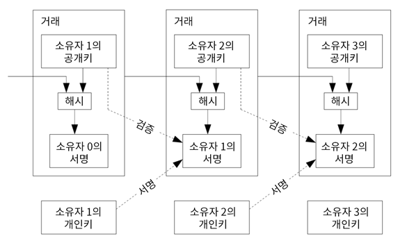
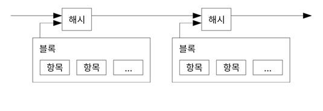
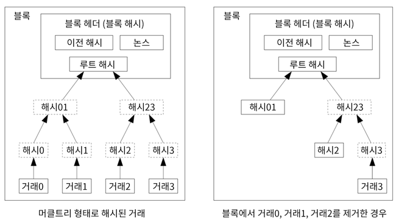
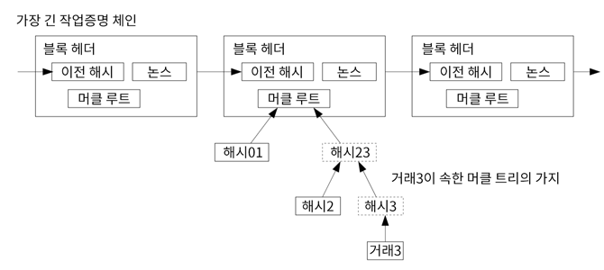
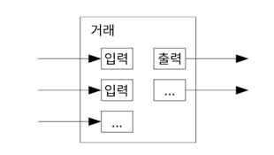
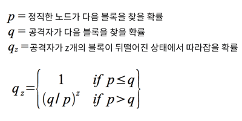

## 초록 Abstract
완전한 P2P 방식의 전자 화폐를 사용하면 금융기간을 통하지 않고 온라인송금이 가능하다. 전자서명은 많은 문제를 해결해주지만, 이중지불 문제를 해결하기 위해서는 신뢰할 수 있는 제3자가 필요하고, 이로 인해 가장 큰 이점이 사라지게 된다. 이 문서를 통해 P2P 네트워크에서 이중지불 문제를 막는 해결책을 제시하고자 한다. 이 네트워크는 암호화 함수를 실행하는 해싱작업을 통해 작업증명(proof-of-work) 내용을 체인에 시간순으로 기록하게 된다. 이는 작업증명을 다시 수행하지 않고는 변경할 수 없는 안전한 형태로 저장된다. 가장 긴 체인은 네트워크에 의해 검증된 거래의 연속적인 기록일 뿐만 아니라, 가장 큰 연산능력의 결과물이기도 하다. 다수의 연산능력이 네트워크를 공격하는데 동조하지 않는 한, 가장 긴 체인이 만들어져서 공격자를 무력화 할 수 있다. 또한 네트워크의 구성요소도 최소한의 것만을 필요로 한다. 메시지는 가능한 최상의 범위까지 네트워크에 전파되고 노드는 네트워크에서 언제든 이탈과 재접속이 가능하다. 이때에 이탈한 기간동안 네트워크가 형성한 가장 긴 작업증명 체인을 받아들이면 된다.

## 서론 Introduction
인터넷 금융거래는 대부분 금융기관을 신뢰받는 제3자로 하는 전자지불 방식에 의존하고 있다. 이 시스템은 일상의 대부분의 거래에서 큰 무리없이 작동하지만, 신뢰기반이라는 원천적인 약점을 지니고 있다. 금융기간은 중재자로서 분쟁의 위협을 받기 때문에, 취소 불가능한 거래라는 것을 보장하지 못한다. 게다가 중재자로써의 비용으로 인한 거래비용 상승,  거래규모의 최소 한도 제한으로 인해 작고 간단한 거래는 원천적으로 불가능해진다. 또한 취소 불가능한 서비스를 제공할 수 없기 때문에 더 많은 비용들이 지출되게 된다. 거래가 취소 가능하다면, 거래시에 더 많은 신뢰가 필요하다. 판매자는 고객에 대한 신뢰를 위해서 그다지 필요하지 않은 정보들까지 요구하게 된다. 그럼에도 일정 비율의 사기가 발생하게 되고 비용증가로 이어진다. 이러한 비용과 불확실성의 증가는, 직접 실물 화폐를 사용한 거래를 통하면 해결할 수 있겠지만, 이렇게 되면 신뢰기관 없는 네트워크를 통해 지불할 방법또한 없어지게 된다.

신용기반이 아닌 암호화 기술에 기반한 전자 지불 시스템을 이용하면, 신뢰받는 제 3자 없이 당사자간 직접 거래가 가능해진다. 전산을 통한 취소가 불가능한 거래는 판매자를 사기로부터 보호할 수 있고, 에스크로를 통해 구매자도 보호할 수 있다. 이 문서에서 P2P 타임스탬프를 이용하여 거래의 시간 순서를 전산을통해 증명하는 방식으로 이중지불을 해결할 수 있는 방안을 제시하고자 않다. 이 시스템은 공격자 그룹의 연산능력보다, 비공격자 노드가 더 많은 연산능력을 보유하고 있는 한 안전하다.

## 트랜잭션 Transaction
전자화폐를 디지털 서명이 연결된 형태로 만들도록 한다. 소유자들은 이전 트랜잭션과 수취인의 공개키를 해시하여 전자서명하고 이를 코인의 뒤에 붙이는 형태로 전송한다. 수취인은 소유권 체인을 확인해 가면서 서명의 유효성을 검증할 수 있다.



문제는 수취인이 원 소유주가 이중지불을 했는지 검증할 수 없다는 점이다. 일반적인 해결방법은 이중지불을 확인하는 신뢰할 수 있는 중앙기관을 두는 것이다. 트랜잭션이 발생하면 모든 코인은 기관으로 들어아고, 수취인에게 새코인을 발행하도록 한다. 이 기관을 거친 트랜잭션만이 유효한 것으로 인정하게 되면 이중지불의 위협에서 벗어날 수 있다. 그러나 이방식은 기관의 운영하는 주체가 전체 시스템의 운명을 결정한다는 문제가 있다.

수취인의 입장에서 자신이 받은 코인은 이전 소유자가 어떤 트랜잭션에도 사용하지 않았다는 확인이 필요하다. 이를 위해 코인을 사용한 해당 서명이 있는 가장 최초의 트랜잭션만 유효하고 뒤에 이어지는 트랜잭션은 확인조차 할 필요가 없다. 이런 상황에서 누락된 트랜잭션을 제거하기 위해서는 모든 트랜잭션을 확인하여야 한다. 중앙기관이 있다면 이 기관이 모든 트랜잭션을 확인하고 순서를 결정해주면 된다. 이런 신뢰받는 기관이 없는 상태에서 해결하고자 한다면, 트랜잭션은 공개되어야 하고 참가자들 모두가 볼 수 있는 단일 이력을 사용하는 시스템이 필요하다. 수취인에게는 트랜잭션이 발생하면 노드의 대다수가 이중거래가 아닌 최초의 트랜잭션이는 증명이필요하다.

## 타임스탬프 서버 Timestamp Server
이 해결책은 타임스탬프 서버에서 시작된다. 타임스탬프 서버는 시간순으로 묶여진 블록의 해쉬를 만들어내고 이 해쉬를 전파하는 역활을 한다. 각각의 타임스탬프는 자신의 올바르다는 것을 증명하기 위해 이전 타임스탬프의 해쉬를 포함하여 자신의 해쉬를 만드는 형태로 체인을 구성하게 된다.



## 작업증명 Proof-of-Work
P2P 를 기반으로 한 분산형 타임스탬프 서버를 만들기 위해서는, 기존에 중앙 서버식이 아니라 Adam Back의 [Hashcash] 와 유사한 작업증명 시스템이 필요하다. 작업증명 방식은 SHA-256 같은 알고리즘을 통해 해쉬되었을 때 그 결과가 0 으로 시작되도록 하는 값을 찾는 것이다. 해쉬를 한번 수행하는 시간은 어떤 평균치에 수렵하게 된고, 요구되는 0 의 수가 많을수록 소요시간이 지수의 형태로 늘어나는 특성을 가진다.

타임스탬프 네트워크는 블록해시를 수행한 결과 만족하는 수의 0을 가질때까지 임의값 nonce 를 증가시키는 방식으로 작업증명을 구현한다. CPU 의 계산 결과가 작업증명 조건을 만족하게 되면, 이블록은 작업증명과 계산을 다시 하지 않는 한 변경할 수 없다. 그리고 임의의 블록을 변경하기 위해서 그 블록이후에 연결된 체인의 모든 블록에 대해서 작업증명을 다시 해야한다.


또한 작업증명 방식은 다수결 의사결정에서의 문제를 해결해준다. 만약 IP 주소당하나의 투표권을 부여하게 되면 IP 주소를 많이 확보하는 것만으로도 시스템을 무너트릴 수 있다. 하지만 작업증명은 연산능력에 비례하여 투표권을 주는 것이다. 가장 긴 체인은 가장많은 연산능력을 포함하고 있으므로 이것이 곧 다수의 결정이 된다. 선의 노드들이 연산능력의 대부분을 차지하고 있다면, 이들의 체인이 가장 빠르게 늘어나 여타 경쟁 체인을 압도할 것이다. 과거의 블록 한개를 수정하려면 공격자는 해당 블록과 이후의 모든 블록에 작업증명을 하여 선의 노드의 블록 길이를 추월하여야 한다. 공격자가 블록을 따라 잡을 가능성은 뒤에 추가로 언급하겠다.

증가하는 하드웨어 속도와 노드를 실행하는 동기를 보상하기 위해 작업증명의 난이도는 시간당 생성되는 블록의 [이동평균]을 통해 정해진다. 만약 블록이 빠르게 생성되면, 난이도는 증가한다.

## 네트워크 Network
네트워크는 아래와 같은 방식으로 동작한다

1. 새로운 트랜잭션이 전체 노드에 전파된다
2. 각 노드들은 신규 트랜잭션을 블록에 담는다
3. 각 노드들은 블록에 가장 어려운 난이도로 행해진 작업증명을 찾는다
4. 노드가 작업증명을 찾게 되면, 해당 블록을 전체 노드에 전파한다
5. 노드들은 모드 거래가 유효하고, 이전에 사용되지 않은 경우에만 블록을 받아들인다
6. 노드들은 다음 블록에 이전블록해시를 추가하는 것으로, 해당 블록을 받아드렸다는 의사를 표현한다.

노드들은 항상 가장 긴 체인을 정당한 것으로 간주하고 체인을 이어간다. 만약 두개의 노드가 각기 다른 버전의 블록을 동시에 전파하는 경우, 다른 버전의 블록을 전달받는 노드들이 발생한다. 이 경우, 전달받은 블록을 기준으로 작업을 수행하지만, 다른 갈래의 블록도 저장하여 해당 블록이 더 길어질 것에 대비한다. 다음 증명이 완료되어 둘 중 하나가 더 긴 체인이 되는 경우, 긴 체인을 형성한 블록을 기준으로 작업하게 된다.

새로운 트랜잭션이 꼭 모든 노드에 전파되어야 할 필요는 없다. 최대한 많은 노드에 전파된다면 이 트랜잭션은 블록이 길어지기 전에 포함될 것이다. 블록의 전파가 누락되는 경우에도 크게 걱정할 필요가 없다. 만약 노드가 중간 블록을 전달받지 못하더라도, 이를 요청하여 받으면 정상적인 체인을 만들 수 있다.

## 보상 Incentive
블록의 첫 트랜잭션은 블록의 생성자에게 새로운 코인을 보내는 특별한 트랜잭션이 된다. 이는 네트워크를 유지하는 노드들에게 보상이 되고, 중앙기구없이 분산된 형태로 유통되는 구조를 만들 수 있다. 새로운 코인이 지속적으로 공급되는 것은 흡사 금광을 캐는 광부들이 자원을 소진하여 금의 순환구조를 만드는 것과 비슷하다. CPU 사용시간과 전력이 소비되는 자원에 해당된다

트랜잭션 수수료도 보상 중 하나다. 트랜잭션은 나가는 돈이 들어온 돈보다 적게 되고, 그 차이는 수수료 형태로 블록을 생성하는 보상으로 제공된다. 초기 예상 발행량이 모드 발행된 이후에는 트랜잭션수수료만 보상으로 주어지며, 이를 통해 인플레이션에서 벗어나게 된다.

이러한 보상체계는 노드들이 선의의 행동을 하도록 장려한다. 만약 이기적인 공격자가 선의 노드보다 많은 연산능력을 가지게 된다면, 다른 이의 지불을 갈취하거나, 새로운 코인을 생성하여 사적인 이익을 취하려 할 것이다. 하지만 이러한 방법보다 정해진 규칙에 순응하는 것이 더 많은 코인을 가져다 주기 떄문에 공격자가 굳이 공격을 해야할 이유는 없다.

## 저장 공간 환원 Reclaiming Disk Space
트랜잭션 이후에 충분히 많은 블록이 오게 되면 해당 트랜잭션은 폐기하고 저장공간을 확보할 수 있다. 블록 해시를 깨지않기 위해 트랜잭션이 [머클트리] 로 해시되고 머클트리의 루트만 블록해시에 포함되면 된다. 오래된 블록은 나무가지를 치즌 것처럼 최소화 할 수 있다. 내부의 해시는 굳이 저장 할 필요가 없다.



트랜잭션이 하나도 포함되지 않은 블록의 헤더는 80Bytes 이다. 만약 블록이 매10분마다 생성된다고 가정하면, 연간 필요한 데이터는 80 X 6 X 24 X 365 = 42MB 가 된다. 2008년에 일반적인 컴퓨터가 2GB 메모리를 장착하고 있으며, 무어의 법칙에 따라 현재기준으로 1.2GB 가 매년 증가하므로, 블록헤더가 메모리에 저장되더라도 큰 문제가 되지 않는다.

## 지불 검증의 간소화 Simplified Payment Verification
플 노드를 운용하지 않더라도 지불을 검증하는 것은 가능하다. 사용자가 가장 긴 체인을 확신할때까지 네트워크 노드들에게 가장 긴 작업증명의 체인을 요청한 다음 해당 블록헤더를 가지고 있으면, 거래가 포함된 머클트리를 얻어올 수 있다. 사용자 스스로 트랜잭션의 유효성을 체크할 수는 없으나, 해당 블록이 체인에 연결되고, 다른 노드들도 해당 블록을 받아들인 이후에 다른 블록이 연결된 것을 확인하면, 네트워크가 이를 유효한 것으로 인식한다고 볼 수 있다.



선한 노드들이 네트워크에 우위에 있다면 검증작업은 신뢰할 수 있지만, 공격자의 힘이 강한 네트워크에서는 신뢰가 어렵다. 네트워크 노드들이 검증절차를 갖고 있다하더라도, 공격자가 지속적으로 네트워크에서 힘을 유지하고 기록을 날조하여 잘못된 트랜잭션 내역을 퍼트리면 속을 수 밖에 없다. 이러한 문제를 막기 위한 방편으로, 사용자의 소프트웨어가 블록전체를 다운로드 받아 모순점이 있는지 확인할 수 있도록 하고, 유효하지 않은 블록을 발견했을 때 네트워크 노드들에게 경고성 알림을 보내는 것이다. 이런 면에서 거래가 많은 사업분야에서는 빠른 검증과 보안을 위해 자신의 노드를 직접 운용하고자 할 것이다.

## 가치의 병합과 분할
코인을 개별적으로 관리하는 것도 가능하지만, 이경우 작은 단위로 트랜잭션을 하기는 불편하다. 가치가 나누어지거나 합쳐질 수 있도록 하기 위해서 복수의 입력과 출력을 허용한다. 보통 입력은 큰 규모의 단일 입력이거나 다수의 소액을 합친 입력일 것이며, 출력의 경우 비용지물과 잔액을 송금자에게 돌려주는 출력 두개일 것이다. 


이것은 흡사 팬아웃처럼 보일 수 있다. 하나의 트랜잭션이 다른 여러 트랜잭션에 영향을 받고, 그 트랜잭션들은 다시 여러개의 트랜잭션에 영향을 받는 식으로 말이다. 하지만 여기서는 문제가 되지 않는다. 트랜잭션 기록을 독립적으로 추출해 낼 필요가 없기 때문이다.

## 프라이버시 Privacy
가존의 은행은 고객 대응집단과 제3자 신뢰집단간의  정보권한을 다르게 함으로써 프라이버시를 보호하였다. 모든 트랜잭션을 공개하는 방식에서는 은행과 같은 방법을 사용할 수 없지만, 프라이버시를 유지하면서 모든 트랜잭션을 공유하는 것이 불가능한 것은 아니다. 공개키들을 익명으로 사용하면 된다. 참여자 모두 어떤 이가 다른에게 얼마를 보냈는지 확인할 수는 있지만, 정작 트랜잭션이 누구에게 귀속되는지는 공개하지 않기 때문에 확인 할 수 없다. 이는 마치 증권 거래소에서 정보를 공개하는 것과 비슷하다. 시간과 거래량은 공개되지만, 누구의 거래인지는 알 수 없는 식으로 말이다.


추가적인 안전장치로, 매 트랜잭션마다 새로운 키를 사용하도록 하여 소유자분별이 어렵도록 하는 것이다. 다수의 입력이 존재하는 트랜잭션일 경우, 입력들이 동일한 소유자에서 온것이 밝혀질 수 있다. 만약 소유자의 키가 공개되면, 다른 트랜잭션도 동일한 소유자라는 것이 밝혀질 위험성이 있으므로 새로운 트랜잭션을 행할 때 매번 새로운  키를 사용하는 것을 권한다.

## 계산 Calculations
공격자가 선의 체인보다 빠르게 체인을 이어갈려는 경우는 생각해보자. 이 공격이 성공한다해도 시스템에 없던 돈을 새로 만들거나 하는 터무니없는 형태로 망가트릴 수는 없다. 노드들은 유효하지 않은 거래는 받아들이지 않을 것이고, 선의 노드는 아예 해당 내용이 블록에 포함되는 것조차 허용하지 않는다. 공격자는 오직 자신이 사용한 코인만 되찾을 수 있다.

선의체인과 공격자 체인의 경쟁은 [Binomial Random Walks] 의 성격을 가진다. 선의 체인이 블록한개를 생성하는 사건에 +1을 부여하고, 공격자 체인이 블록한개를 생성하는 사건에 -1을 부여하도록 하자. 

공격자가 뒤쳐진 상태에서 선의 체인을 따라잡을 가능성은 [도박군의 파산] 문제와 유사하다. 적자에서 시작한 도박사가 무제한의 신용으로 무한대로 게임을 하여 손익분기점에 도달한다고 하자. 그가 손익분기점에 도달할 확률, 혹은 공격자가 선의 체인을 따라잡을 확률은 다음과 같이 계산할 수 있다.



*p>q* 라고 하면, 공격자가 블록을 따라잡을 확률은 따라잡아야 하는 블록 수의 지수로 감소한다. 공격자가 가능한 빨리 성공하지 못한다면, 가능성은 시간이 흐를수록 희박해진다.

수신자의 입장에서 송금자가 거래를 변조하지 못할 거라 판단되는 충분한 기가은 얼마인지 고려해보자. 공격자인 송금자가 수신자로 하여금 일정기간동안 자신은 돈을 받았다고 믿도록 하다가, 다시 돈을 자신에게 되돌리는 시도를 할 것이다. 수신자는 이에 대한 경고를 받겠지만, 공격자는 최대한 늦게 이 정보가 수신자에게 가도록 할 것이다.

수신자는 새로운 키 쌍을 생성하여, 송금자에게 공개키를 보낸다. 이는 공격자가 미리 블록을 만들어 두는 것을 방지한다. 거래가 전송되면 공격자는 다른 거래 내역을 포함한 체인을 다시 생성하게 된다.
수신자는 거래가 블록에 포함되고, z개의 블록만큼 추가되길 기다린다. 그는 공격자가 어느정도의 작업을 진행했는지는 모르지만, 올바른 블록들은 평균적인 블록생성시간에 생성될것을 알 수 있다. 공격자의 잠재적 진행률은 [푸아송 분포] 에서의 기대값과 같다


> 공식을 설명하면 공격자가 변조하고 싶은 블럭이 z 개 이전에 있다고 가정한다.
> 결과적으로 블록을 따라잡는데 k 만큼 시간이 걸린다고 했을때, 해당 사건이 발생할 확률이다
> 우측의 조건은 k 와 z 의 차이가 발생할 확률이다. 즉 z 개의 블럭을 만들었을때 올바른 체인보다 더 빠를 확률은 (q/p)^(z-k) 가 된다. 
> z보다 더 오랜시간을 사용해서 따라잡을 확률은 1, 즉 100% 


 > k < z 인 경우, 즉 공격자가 더 빠르게 블록을 작성할 경우를 계산해 보자.
 > 이것은 해석하면 공격자가 z 만큼 지난 블록을 다 따라잡고 가장 긴 체인을 작성할 확률이 된다


이를 C 코드로 작성하면
``` c++
#include <math.h>
double AttackerSuccessProbability(double q, int z)
{
	double p = 1.0 - q;
	double lambda = z * (q / p);
	double sum = 1.0;
	int i, k;
	for (k = 0; k <= z; k++)
	{
		double poisson = exp(-lambda);
		for (i = 1; i <= k; i++)
			poisson *= lambda / i;
		sum -= poisson * (1 - pow(q / p, z - k));
	}
	return sum;
}
```
실행 결과를 보면 z 의 증가에 따라, 지수형태로 확률이 감소하는 것을 볼 수 있다

q=0.1
z=0    P=1.0000000
z=1    P=0.2045873
z=2    P=0.0509779
z=3    P=0.0131722
z=4    P=0.0034552
z=5    P=0.0009137
z=6    P=0.0002428
z=7    P=0.0000647
z=8    P=0.0000173
z=9    P=0.0000046
z=10   P=0.0000012
   
q=0.3
z=0    P=1.0000000
z=5    P=0.1773523
z=10   P=0.0416605
z=15   P=0.0101008
z=20   P=0.0024804
z=25   P=0.0006132
z=30   P=0.0001522
z=35   P=0.0000379
z=40   P=0.0000095
z=45   P=0.0000024
z=50   P=0.0000006


> 위의 공식들에 대한 종합 설명
> 공격자의 상대는, 자신이 계약한 트랜잭션뒤에 다른 블록이 붙을때까지 거래에 대해서 완료하지 않는다.
> 후속 블록이 z 개 만큼 생겼을때 거래를 인정하게 된다
> 공격자는 이 거래에 대한 이익을 챙기고, 거래 자체를 없었던 것으로 하고 싶어진다.
> 따라서 z 블록이전으로 돌아가 전혀 다른 블록을 생성해서 네트워크에 퍼트린다. 
> 이 때 다른 노드에서 네트워크에 새로운 블록을 퍼트리기전에 자신이 먼저 퍼트려야 한다. 이 확률이 q 가 된다.
> 즉 마지막 표를 해석하면
> *해시값을 먼저 계산할 확률이 10%(q=0.1) 이고, 5블럭(z=5) 이전을 수정해서 자신이 가장긴체인으로 등장할 확률은 0.1 % 이다*
> *6블럭이전은 0.025%,  7블럭이전은 0.0065% 가 된다*


P 가 0.1 보다 작은 경우는

P < 0.001
q=0.10   z=5
q=0.15   z=8
q=0.20   z=11
q=0.25   z=15
q=0.30   z=24
q=0.35   z=41
q=0.40   z=89
q=0.45   z=340

> 제일 마지막 표는 공격성공률을 0.1% 이하로 하려면 추가 블럭을 몇개나 이어야 하는지를 알려준다
> 공격자의 해시능력이 10%라면, 5블럭 이후가 되어야 성공률이 0.1% 이하가 되는것이다.
> 공격자가 무려 40%의 해시능력을 가졌다면 340 블럭이 지나야 공격성공률이 0.1% 이하가 된다.

## 결론 Conclusion

지금까지 신뢰을 기초로 하지않는 P2P 전자 거래 시스템을 제안하였다. 전자 서명으로 이루어진 기존의 형태는 소유권에 대한 강한 통제권을 제공하지만, 이중지불을 막지 못하면 불완전 할 수 밖에 없다. 이를 해결하기 위해 작업증명을 이용하여 공개적으로 거래를 기록하는 P2P 네트워크를 제안한다. 이 방식은 올바른 노드들이 다수의 연산능력을 확보하고 있다면, 공격자가 쉽게 조작하는 것이 불가능하다. 네트워크는 간결하게 설계되었지만 충분히 튼튼하다. 노드들은 약간의 협력만으로 합의가 가능하다. 노드들은 언제든 네트워크에서 이탈과 재합류가 가능며, 이탈한 동안에 이루어진 작업증명의 체인을 받아들이기만 하면 된다. 유효한 블럭의 뒤에 블록을 연장하고, 유효하지 않은 블록은 거부하는 행위를 통해 작업증명 연산능력은 참여자들의 의사표현의 수단이 된다. 이러한 합의 구조는 규칙 및 보상을 통해 유지된다.


[Hashcash]: https://en.wikipedia.org/wiki/Hashcash
[이동평균]: https://ko.wikipedia.org/wiki/%EC%9D%B4%EB%8F%99%ED%8F%89%EA%B7%A0
[머클트리]: https://steemit.com/kr/@brownbears/merkle-tree
[Binomial Random Walks]: http://www.real-statistics.com/binomial-and-related-distributions/binomial-distribution-and-random-walks/
[도박군의 파산]: https://ko.wikipedia.org/wiki/%EB%8F%84%EB%B0%95%EA%BE%BC%EC%9D%98_%ED%8C%8C%EC%82%B0
[푸아송 분포]: https://ko.wikipedia.org/wiki/%ED%91%B8%EC%95%84%EC%86%A1_%EB%B6%84%ED%8F%AC
