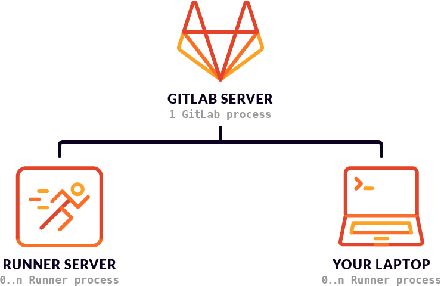
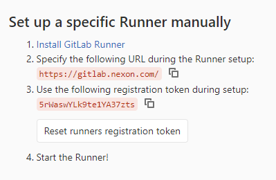
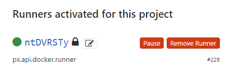
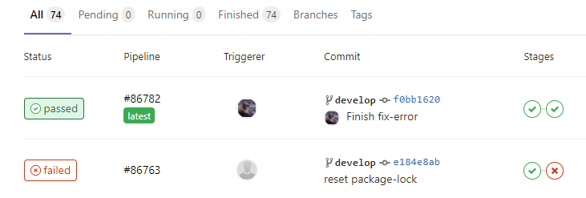
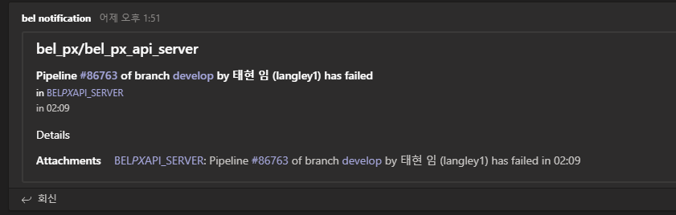

요즘 CI/ID 분야가 매우 핫하다. CI/CD는 Continuous Integration 과 Contiuous Delivery(혹은 Deployment) 의 약자인데 해석하면 _지속적인 통합/배포_ 정도가 되겠다.
CI/CD 는 애플리케이션개발을 자동화하여 더 짧은 주기로 고객에게 제공하는 것을 목표로 한다. 대규모 개발팀에서 일해 본 사람은 공감하겠지만, 개발 통합작업은  일정을 변경해야 할 정도로 심각한 문제가 자주 발생한다. 특히 개발팀과 운영팀이 나누어져 있는 경우에 커뮤니케이션을 위한 비용때문에 해야할작업 (보고, 피드백, 확인등등) 이 매우 많아진다. 이들 중 가능한 것을 자동화 하는 것이 CI/CD 의 기본 형태이다.

특히 요즘같이 애잘일을 비롯한 빠른 개발이 주목받고 있는 상황에서, 많은 개발조직이 CI/CD 를 적극적으로 도입하고 있다.


# CI? CD?
경우에 따라서 이 둘을 분리하기도 하고 같이 처리하기도 하는데, 의미를 정확히 짚어보도록 하자

CI는 일반적으로 개발자를 위한 프로세스가 된다 CI 가 성공적으로 진행되면, 코드의 변경사항이 빌드 와 테스트가 되었다는 뜻이므로 개발팀의 입장에서 이 코드는 어느정도 검증되었다는 의미가 된다.
CD는 개발팀의 작업물이 테스트와 패치노트를 통과해서 사용자에게 도달하는 프로세스가 된다. 테스트용 스테이지와 마지막으로 배포용 스테이지의 순서로 전달되는 과정이 이에 해당한다.

CI/CD 를 사용한다는 것은 사실상 개발 프로세스를 일종의 파이프라인화시켰다는 의미가 된다.


# Gitlab 의 CI/CD 시스템

Gitlab 에는 [CI/CD](https://about.gitlab.com/stages-devops-lifecycle/continuous-integration/) 가 내장기능으로 제공된다.
Gitlab 의 CI/CID 의 가장 큰 특징은 [Runner](https://docs.gitlab.com/runner/) 를 사용한다는 것이다.

Gitlab Runner(깃랩 러너) 는 빌드나 테스트를 진행해주는 어플리케이션이다.  이 어플리케이션은 깃랩에서 소스를 받아와서 지정된 동작을 수행하게 된다.
일반적으로 러너는 전용 서버를 구축해서 설치하게 되지만, 데스크탑에 설치해서 나만을 위한 러너도 설치할 수 있다.

# Gitlab Runner
깃랩러너는 Go 언어로 작성되어졌고, 단일 파일로 실행가능하며, 다른 라이브러리의 설치를 요구하지 앟는다. 또한 대부분의 환경 (Linux, macOs, Windows, Docker) 에서 실행가능하다.

> 여기서 추천하자면 Docker 버전을 추천한다. 다른버전을 모두 써본것은 아니지만, 가장 오류가 적었다.

## 설치
우선 [Docker 를 설치](https://docs.docker.com/get-docker/)하여야 한다.
그리고 도커의 볼륨을 깃랩 컨테이너에 마운트 해주는 식으로 설치한다

``` bash
   docker run -d --name gitlab-runner --restart always \
     -v /srv/gitlab-runner/config:/etc/gitlab-runner \
     -v /var/run/docker.sock:/var/run/docker.sock \
     gitlab/gitlab-runner:latest
```

옵션을 간단히 설명한다
* `-d`: 도커를 백드라운드로 실행한다.
* `--restart`: 도커가 실행되면 항상 이 컨테이너도 같이 실행한다는 뜻이다. 컨테이너가 종료되면 자동으로 재부팅된다.
* `-v`: 볼륨을 마운트한다
* `gitlab-runner:latest`:  도커 리파지터리에 등록된 이미지중에 가장 최신을 사용한다

## 등록
실제 깃랩러너와  깃랩서버는 물리적으로 다른 공간에 있다


따라서 이둘이 서로를 알 수 있게끔 연결해주어야 한다.
일반적으로 러너가 실행되는 프로세스가 외부접속을 받아들이기 힘들기 때문에 러너가 깃랩서버에 접근하는 방식을 사용한다

러너는 프로젝트 소스코드에 접근이 가능하기 때문에 인증과정이 필요하다.


아래는 실제로 프로젝트에서 사용된 인증코드이다.
토큰은 프로젝트별로 다르고, 이 토크은  캡쳐후 바로 리셋하여서 지금은 쓸수 없다


이것을 사용해서 gitlab-runner 어플리케이션을 깃랩에 등록하도록 하자
### register 명령을 실행
``` bash
docker run --rm -it -v /srv/gitlab-runner/config:/etc/gitlab-runner gitlab/gitlab-runner register
```
이 명령을 실행하면 이제 아래의 내용이 나오면서 사용자의 입력을 기다리는 프롬프트가 보인다.
하나씩 처리하도록 하자.

### Gitlab 주소를 입력
``` bash
Please enter the gitlab-ci coordinator URL (e.g. https://gitlab.com )
https://gitlab.com

```

### 등록 토큰을 입력
``` bash
Please enter the gitlab-ci token for this runner
xxx
```

### 러너의 이름을 입력
``` bash
Please enter the gitlab-ci description for this runner
[hostname] my-runner
```
이 이름은 Project -> Settings -> CI/CD -> Runners 항목에서 볼수있다


### 태그입력
``` bash
Please enter the gitlab-ci tags for this runner (comma separated):
my-tag,another-tag
```

태그는 주의해야한다. 러너의 태그와 일치하는 branch 혹은 commited tag 에만 반응을 한다. 태그를 입력하지 않으면 모든 커밋에 반응을 하게 된다.

### 러너를 실행하는 환경 정의
여기서는 docker 가 가장 무난하다.
```
Please enter the executor: ssh, docker+machine, docker-ssh+machine, kubernetes, docker, parallels, virtualbox, docker-ssh, shell:
docker
```

# 파이프라인 설정
러너설정이 끝났으면 이제 이 러너에서 실행하게 될 명령을 정의하자
깃랩은 기본설정으로  `.gitlab-ci.yml` 을 프로젝트 루트에 만들면 이 파일에 있는 명령을 CI/CD 파이프라인으로 실행한다. (파일위치와 이름은 설정에서 변경가능)

기본적인 형태는 다음과 같다
``` yaml
image: node:latest

stage:
    - build

job:
    stage: build
    script:
        - npm run build
```

### image
`image` 는 러너가 사용할 기본 도커 이미지의 이름이다. 이 이미지들은 docker 에서 무료로 제공해주는 이미지중에 하나를 사용할수 있고, 필요하면 직접 도커이미지를 만들어서 올릴수도있다. 
이번프로젝트는 node 를 사용하는 api 서버였으므로 기존에 node 가 설치된 도커이미지로도 충분하다. 아무것도 없는 이미지가 필요하다면 ubuntu 나 windows 같은 이미지를 찾아서 사용하도록 하자.

### stage
`stage` 는 파이프라인전체에 영향을 미치는 설정으로, stage 에 정의된 순서대로 작업이 실행된다. 그리고 같은 stage 에 포함된 작업은 모두 동시에 실행된다.

예를 들어
``` yaml
stage:
    - test

job-lint:
    stage: test
    script: npm run eslint

job-test:
    stage: test
    script: npm run test
```

위의 두 작업 lint  와 test 는 동시에 실행되게 된다. 사실 이 둘은 동시에 실행되어도 문제가 없으면 둘중에 하나라도 실패하면 이 스테이지는 실패하게 된다. 만약에 순서가 민감하다면 같은 스테이지에 넣지 않거나 하나의 작업에 순서대로 넣는 방법이 있다. 아래에 순서에 민감한 작업을 하나의 작업에 넣는 방법을 예시로 보여준다
``` yaml
stage:
    - test
    - build

job-lint:
    stage: test
    script: npm run eslint

jot-test:
    stage: test
    script: npm run test

job-build:
    stage: build
    script: 
        - rm dist -rf
        - npm run build
```

build 라는 스테이지가 추가되었다. 이 스테이지에서는 dist 폴더를 지우고 빌드를 실행하는데, 순서가 민감하기 때문에 같은 작업에 배치하였다

### only
예를 들면 테스트는 모든 브랜치에 적용하지만 빌드는 develop 브랜치에서만 동작하게 하고 싶을때가 있다. 이때 사용할 수 있는 옵션이 `only` 이다

``` yaml
stage:
    - test
    - build

job-build:
    stage: build
    only: develop
    
```

이제 job-build 라는 작업은 develop 브랜치에만 반응하게 된다

### before_script, after_script
빌드하는 과정에서 모든 작업에 공통으로 실행하고 싶은 명령이 있을수 있다. 이 때는 `before_script` `after_script` 를 사용하면 된다. before_script 는 말 그대로 모든 작업에서 가장 먼저 실행되고 after_script 는 가장 나중에 실행된다.

예제로 모든 작업에서 항상 `npm install` 을 하게 해보자

``` yaml
stage:
    - test
    - build

default: # default 는 모든 작업에 영향을 미친다
    before_script: npm install 

job-lint:
    stage: test
    script: npm run eslint

jot-test:
    stage: test
    script: npm run test

job-build:
    stage: build
    before_script:  # 개별작업에 할당된 before_script 는 글로벌정의를 무시하고 덮어씌운다
        - npm update 
    script: 
        - rm dist -rf
        - npm run build
```

# 결론

Gitlab CI/CD 를 사용해서 테스트를 하고 그 결과를 손쉽게 확인하는 것은 흥미로운 작업이었다

이 결과는 Project -> CI/CD -> Pipeline 에서 확인이 가능하며 


필요하면 MS Teams / Slack / EMail 에 알림을 할 수도 있다.


여기에 실제로 사용한 테스트용 CI 코드를 첨부한다
``` yaml
mage: node:latest
 
cache:
  untracked: true
  key: "$CI_BUILD_REF_NAME"
  paths:
    - node_modules/
    
stages: 
  - install
  - test

job:install:
  stage: install
  script:
    - npm install

job:lint:
  stage: test
  script: 
    - npm run lint

job:jest:
  stage: test
  script: 
    - npm test
```