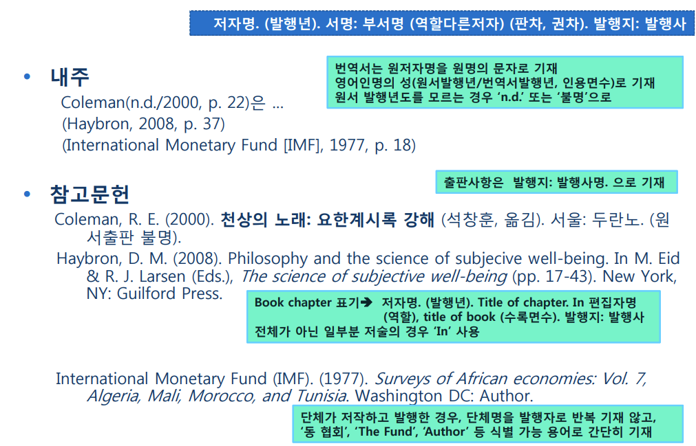

논문도 기본적으로는 글이다. 그러므로 "좋은 글 쓰기" 를 배우는 것이 제일 중요하다.
하지만, 우리는 대부분 팁이라는것이 없으면 섭섭한 기분이 든다. 그래서 조금이나마 기분이 좋아지도록 살짝 적어보았다.

# 공학논문의 정의
공학논문은 조금 특이한 특성을 가진다.

* 증명가능하여야 한다
* 객관성이 있어야 한다.
* 독창적이어야 한다

증명은 실험의 경우 독자가 실험을 해볼 수 있도록 상세히 설명해주어야 하고, 
소프트웨어나 알고리즘은 구현이 가능한 수준의 설명이 있어야 한다.

객관성을 지키기 위해서는 추상적인 단어, 예를 들어 매우 많다 라든가, 납득가능한 수치라는 표현은 쓰면 안된다. 좋다 나쁘다 같은것도 객관적인 글읽기를 방해한다.

독착성을 한마디로 정리하면 도둑질 하지 말자.

# 공학논문의 효과적인 구성

흔히 사용하는 방법으로 IRMAD 와 같은 것이 있다.

꼭 지켜야 할 규칙은 아니지만, 이상하게 쓰는 것보다는 훨씬 낫다.
각 단계별로 하나씩 간략히 살펴보자

### 제목
제목은 글을 읽는 사람에게 동기를 부여하는 중요한 역활을 한다. 극 소수의 능력자들은 저널같은곳에 기고할 때를 고민하겠지만, 일반인인 우리는 어떤 검색어로 내가 쓴 논문이 검색될지만 고민하자.

좋은 제목을 짓는 방법은 ... 사실 나도 미숙하므로 [책이나 인터넷](https://m.blog.naver.com/PostView.nhn?blogId=editage_kr&logNo=70184245636&proxyReferer=https:%2F%2Fwww.google.com%2F)의 도움을 얻도록 하자.

### 초록 / Abstract
좋은 제목을 지었으면 **초록/Abstract** 을 잘 적어야 한다. 초록하면 조금 단어가 어려울 수 있는데, 쉽게 말해 요약본이다. 대부분의 논문이 제목만으로는 전체 내용을 파악하기 힘들기 때문에 일반적으로 초록까지는 읽어본다. 따라서 제목과 초록이 한페이지안에 들어가도록 구성하는 것은 독자의 흥미를 떨어트리지 않는 좋은 방법이다. 

### 서론 : 연구배경과 가설
기존의 이론이나 논문을 이용해서 자신이 세운 가설을 전개하게 된다. 기초가 되는 논문과 이론을 밝히고 거기에 자신의 가설을 올리는 식이다. 사실 논문이 아니어도 가능하지만 이 기초이론역시 독자가 원한다면 증명가능하여야 한다. 그래서 일반적으로는 논문과 같은 검증가능한 포맷을 기반으로 선택한다. 여기에 자신의 가설, 기능개선이나 혹은 다른 분야에의 적용과 같은 것을 이어서 설명한다.

### (연구)방법/ Method
연구방법은 분야마다 조금씩 다른데 소프트웨어쪽에 관련된 이야기를 해보도록 하겠다. 일반적으로 방법은 소제목을 [방법-Method] 와 같이 직접적으로 쓸 필요는 없다. 여기서부터는 작성자가 좋다고 생각하는 포맷을 취하면 된다. 

흔히 제목으로 사용하는 것은 다음과 같다. 글의 흐름이 제일 중요하므로 참고만 하자.
* 시스템 이름 (체인네트워크,  3차원 벡터공간)
* 알고리즘 이나 모듈 (정규화, 다차원 벡터구현)
* 실제 테스트 (데이터 셋, 구현 코드)

개인적으로는 데이터셋이나 코드는 독자들이 검증할 수 있도록 개인 웹사이트와 같은 곳에 공개해야한다고 생각한다.
특히 많은 대학교에서는 논문은 장기보관하면서 실험 데이터셋은 그렇게 하지 않는지.. 약간 불만이다.

### 결과 / Result
어떻게 보면 가장 중요한 파트이다. 앞에서 말한 이론과 구현(실험)에 의해서 원하는 결과가 나왔는지를 기술한다. 소프트웨어쪽 연구는 대부분 정확도나 처리 속도, 처리량과 같은 성능개선에 관계된 것이 많아서 결과는 그래프나 차트형태로 나오는것이 일반적이다. 물론 꼭 그래야하는 것은 아니다. 블록체인 초기에는 단지 구현이 된 것만으로도  결과로 인정해주었다. (그럴만한 가치가 있으니까!! )

제일 중요한 것은 서론에서 제시한 가설과 이론에 대한 결과를 정리해주는 것이다. 서론에서 Accuracy 에 대한 이야기를 하고, 결과는 Volume Per Sec 를 얘기하는 것은 그리 좋지 않다. 작성자는 의미있다고 주장할 수 있지만,이 논문을 읽는 사람들은 자신이 원하는 내용을 검색해서 들어 왔기 때문에 시간낭비가 될 수 있다. 이럴때는 논문 제출전에 제목과 초록을 바꾸면 해결된다.

그리고 공학논문이기 때문에 장황한 수식어는 사용하지 않았으면 좋겠다.

### 생각할점 / Discussion
공학논문에서 가장 주관적으로 글을 쓸 수 있는 부분이다. 우선 자신의 논문에서 부족한 부분, 혹은 추가로 개선이 가능한 부분들을 기술할 수 있다. 예를 들면 데이터셋을 바꾼다면 더 좋은 결과를 얻을 수 있을 것 같다와 같은 예상을 적는 것도 가능하다. 혹은 앞으로 관련된 기술이 발전하면 실용적으로 사용할 수 있을 것이다 같은 미래 이야기도 괜찮다. 물론 SF 소설을 쓰는 것은 곤란하지만, 논문을 준비하면서 얻은 인사이트와 의견을 가상의 독자를 앞에 두고 이야기한다라고 생각하면 된다. 물론 이 파트는 없어도 무방하다.

### 결론 / Conclusion
마지막으로 마무리 결론에는 앞의 결과를 간단히 몇줄로 정리하는 과정이다. 앞에서 복잡한 수식과 코드를 사용했다면 여기서는 그것을 평문으로 잘 풀어서 설명해주면 된다. 가끔 위의 Discussion 과 합쳐져서 기술되기도 한다. 어느쪽이든 상관없다.

예를 들어 결과Result 에서 
> score : 0.7
이라고 나왔으면, 결론 Conclusion 에서는 
> 이전 이론 대비 10% 이상 스코어가 향상되었다. 
정도면 충분하다.

### 참고문헌
끝으로 결론뒤에는 참고문헌을 적어주어야 한다. 논문뿐만 아니라 기사, 인터뷰, 책 심지어 블로그를 참고했다면 다 적어주어야 한다. 이부분은 길다고 비난받지 않으니까 정직하게 쓸것. 
특히 이부분은 어느정도 형식을 지켜주어야 한다. 다른부분은 꼭 지켜야 할 형식이 사실 없지만, 이부분은 최대한 형식에 맞추어서 써야 한다.

[참고문헌 작성법](https://korean.scd.edu.au/pluginfile.php/32123/mod_resource/content/4/%EC%B0%B8%EA%B3%A0%EB%AC%B8%ED%97%8C%20%EC%9E%91%EC%84%B1%EB%B2%95%20-%20%EC%84%9C%EC%9A%B8%EB%8C%80%20%EB%8F%84%EC%84%9C%EA%B4%80.pdf) 에 나와 있는 내용을 요약해보면

원포인트 팁으로 실용적인 부분을 발췌해 보았다
**참고문헌 기재**
  * 단행본 : 저자. (발행년). 서명. (판사항). 발행지:발행사
  * 학술지 : 저자. (발행년). 논문명. 저널명. 권, 페이지정보
  * 학위논문 : 저자. (수여년). 논문명 (학위명). 수여기관명, 소재지
  * 컨퍼런스 발표 : 저자. (년, 월). 논문명. 컨퍼런스명, 소재지.

