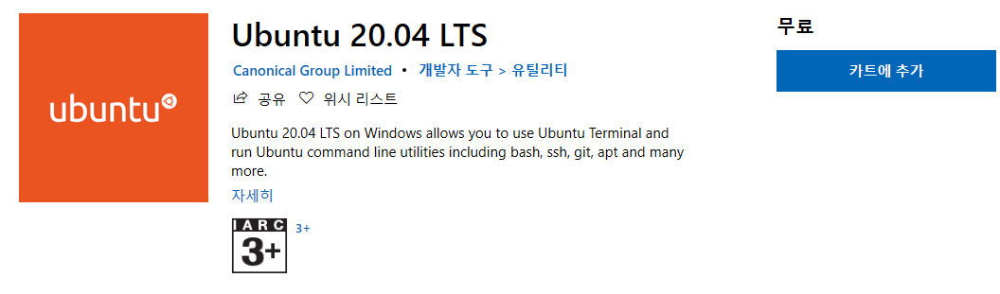
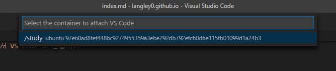
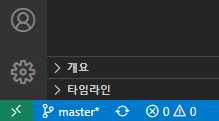
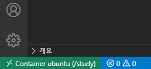
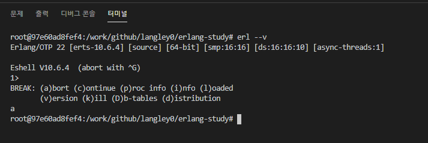
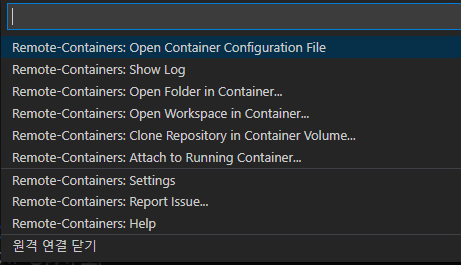

## 시작하며
먼저 이작업을 시작하게 된 이유는 업무의 하나로 erlang(이후 얼랭) 을 할 일이 생겼기 때문이다. 얼랭은 나중에 별도로 글을 쓸 계획이지만, 윈도우즈에서 컴파일하고 실행하기 위해서 MinGW를 설치해야하는 것을 포함해 절차가 매우 복잡하다. 간단히 설명하면 리눅스용을 어떻게든 윈도우에서 실행되도록 했다는 뜻이다. 이쯤되면 그냥 리눅스에서 하는것이 더 쾌적하게 개발 할 수 있을 것 같았다. 

## I love VSCode
리눅스에서 개발을 하는 것에서 가장 마음에 걸리는 것이, Vim 으로 작업을 할 생각을 하면 눈물이 살짝 고인다는 것이다. 어떻게 하든 VS Code 를 포기할 수는 없었다. 여기까지 생각이 오자 그럼 Docker 를 이용해서 리눅스를 실행하고, VS Code 로 도커안에 있는 파일을 편집할 수 있다면 좋은 개발 환경을 구축할 수 있을 것이라는 확신이 들었다.

## 왜 도커인가?
사실 윈도우즈용 리눅스 터미널을 사용하면 더 편하게 구축할 수 있을것이라는 것은 안다. 대부부의 경우에는 이쪽을 쓰는 것이 좋을 것이다.



그런데 이전에 Ubuntu 터미널을 너무 안일하게 사용하다가 다른 가상화레이어를 사용하는 어플리케이션하고 충돌한 경험이 있다. 이게 단순 오류메시지가 뜨는게 아니라 블루스크린과 함께 리붓이 되어버리는 경험이었다. 때문에 비교적 안전한 도커를 선택한 것이다. 

아마 이 문제는 WSL2 가 나오면서 해결되었을 것 같은데, 괜히 모험하기 싫은 귀차니즘 + 보수적인성향 때문에 도커를 선택한 것이다. 이후에 여유가 생기면 윈도우즈용 터미널을 통해서 작업환경을 구축할 계획이다.

## 도커 설치 및 실행
WSL-Windows Subsystem for Linux 기능을 활성화하여야 하기 때문에 바로는 실행이 되지 않는다. 하지만 [공식 가이드](https://docs.docker.com/docker-for-windows/) 를 따라서 하면 별다른 어려움없이 성공할 수 있다.

VS Code 는 설치 및 실행이 너무 간단하기 때문에 별도로 언급하지는 않는다.


## 연결
VS Code 에 Remote Development 라는 확장을 설치한다.

``` text
이름: Remote Development
ID: ms-vscode-remote.vscode-remote-extensionpack
설명: An extension pack that lets you open any folder in a container, on a remote machine, or in WSL and take advantage of VS Code's full feature set.
버전: 0.20.0
게시자: Microsoft
VS Marketplace 링크: https://marketplace.visualstudio.com/items?itemName=ms-vscode-remote.vscode-remote-extensionpack
```


이후에 작업실행 (일반적으로 F1) 에서 `Remote-Container: Attach to Running Container` 를 선택하면 약간 시간이 걸린 후에 (생각보다 오래 걸린다) 컨테이너 선택화면 나온다. 주의할 것은 실행중인 도커의 컨테이너목록만 나오기 때문에, 목록에 없으면 실행중 여부를 확인해보자.




컨테이너를 선택하면 새로운 VS Code 가 실행된다. **기존 것에는 연결되지 않는다!!**

제대로 연결되었는지 확인하는 방법은 좌측 하단에 연결 상태를 보는 것이다.

**오프라인 상태 vs 온라인 상태**





## 작업 방법
터미널 (일반적으로 Ctrl +` 로 실행) 을 켜면 우리가 아는 윈도우즈의 패스가 아니라 도커에서 실행중인 컨테이너의 패스가 나온다. 이경우에는 Ubuntu 이다.



우측에 워크스페이스에도 도커안에 있는 파일들이 보이기 때문에 편하게 작업할 수 있다.

## 연결 종료
이래도 VS Code 를 종료해도 다음번에 마지막 연결을 기억해서 계속 도커에 연결을 시도할 것이다. 그래서 명확하게 연결종료 명령을 해야한다.

다시위에 온라인 상태 표시로 돌아가보자


여기서 `Container Ubuntu` 라는 글자를 클릭하면 작업실행이 나오는데 메뉴 마지막에  `원격 연결 닫기` 라는 항목이 보인다



이것을 클릭하면 VS Code 가 재실행되면서 오프라인상태가 된다.

