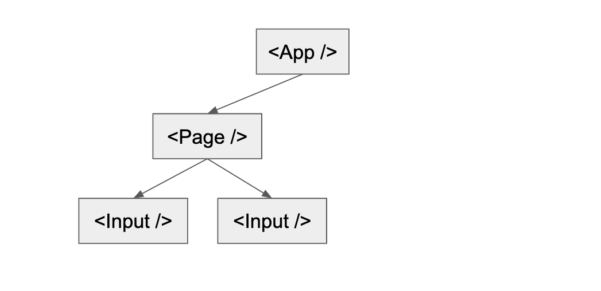
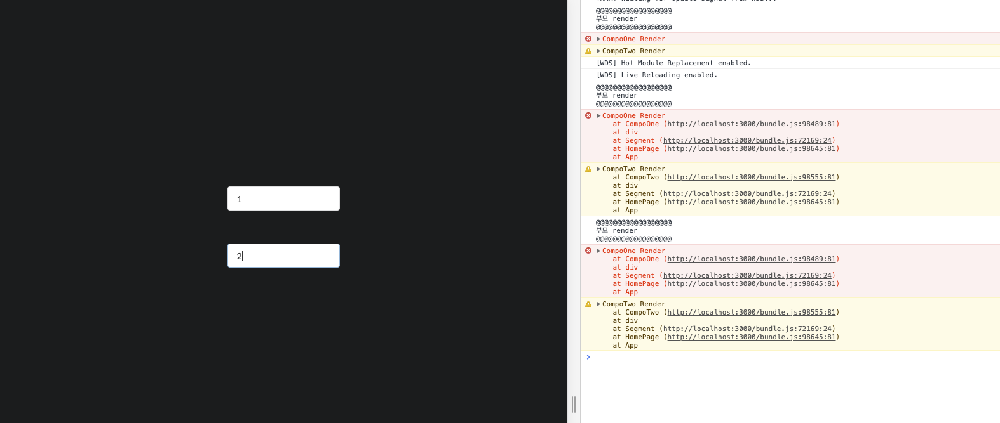
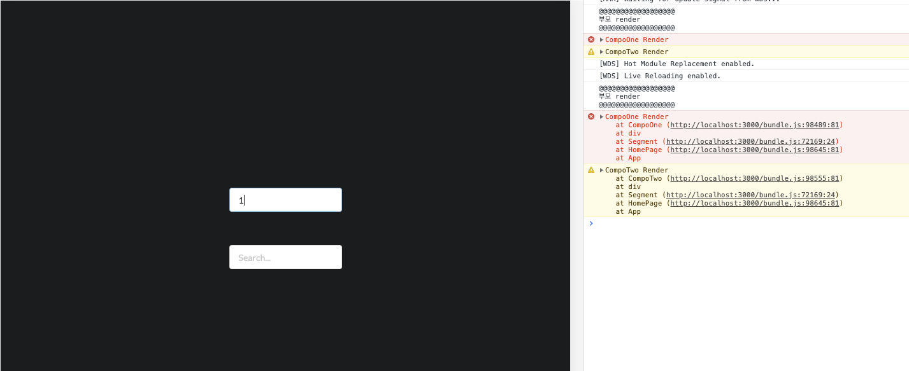
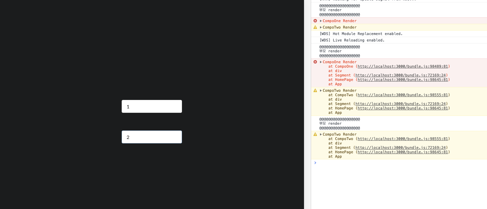
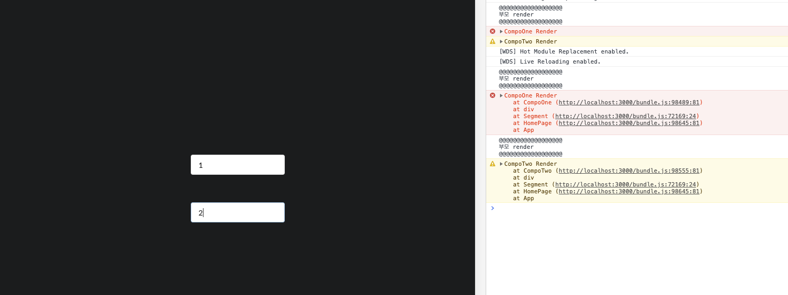
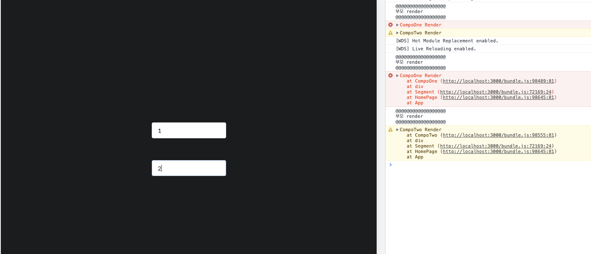
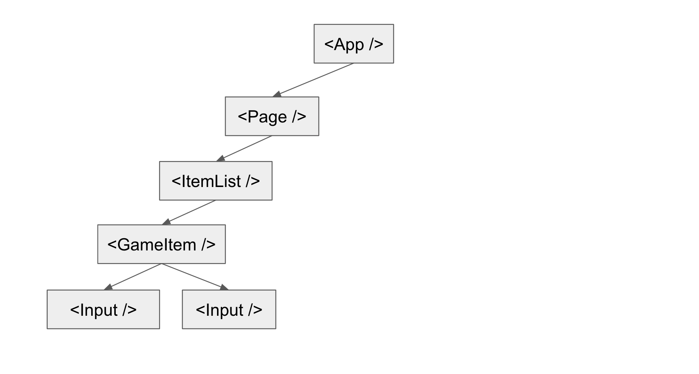

# PureComponent란?

 React에서는 3가지 Component들이 존재한다.

- React.Component

```jsx
class Ryuk extends Component {
	render() {
		return(
			<div>
				안냐세여
	    </div>
		)
	}
}
```

- React.PureComponent

```jsx
class Ryuk extends PureComponent {
	render() {
		return(
			<div>
				안냐세여
	    </div>
		)
	}
}
```

- Function Component

```jsx
const Ryuk = () => {
  return (
    <div>
			안냐세여
    </div>
  );
};
```

각 컴포넌트들의  세세한 특징들이 있겠지만, 우리는 `PureComponent` 와 `Component`의 차이만 간단하게 짚어보자. 열심히 검색을 하다보면 **두 컴포넌트의 차이는 shouldComponentUpdate() 라이프 사이클**이라는 답을 찾을 수 있을 것이다.

- **React.PureComponent는 React.Component에 shouldComponentUpdate()가 적용된 버전이다.**

(엄밀히 말하면 **shouldComponentUpdate()**안에 **얕은비교**가 적용된 버전이다.)

### 아직 만들지도 않았는데.. 내 웹이 버벅거리네 ㅎㅎ

 React의 state를 사용 하던, 좀 더 구조화해서 사용할 수 있는 redux를 사용하던, 좀 더 쉽게 쓸 수 있는 mobx 를  사용하던, 우리는 state가 변경 될 때마다 컴포넌트들이 다시 render 되는 모습을 볼 수 있다.


정신 없어 보이지만, 자식1 을 고쳐도 부모, 자식2 가 함께 Re-render 되는 모습이다. (console.error가 3개씩)

위의 gif 처럼 **자식2** **(두 번째 Input창)**의 값이 변경 되지 않아도, **자식1의 변경**으로 인하여 Re-render되는 형상이 가볍게만 느껴지지 않는다. 혹여 render하면서 반응형을 체크 하거나, 또 그 하위 자식들이 많을 경우 이는 분명 성능 문제를 일으킬 것이다.

### 그래서.. PureComponent란 말이다.

 위에서 언급했듯이 PureComponent는 Component **shouldComponentUpdate()**안에 `얕은 비교`가 적용된 버전이다.

**얕은 비교 (shallow-compare)**

 PureComponent는 shouldComponentUpdate() 라이프 사이클에서 얕은 비교를 통해 업데이트 여부를 결정한다.

- 변수와 문자열에서는 값을 비교한다.
- 객체에서는 reference 값을 비교한다.

```jsx
**shouldComponentUpdate() {
	if(아니 그래서 너 진짜 바뀌었니?) {
    그렇다면 render() 하렴;
  } else {
    그렇다면 render 하지마렴;
  }
}**
```

즉, 우리가 직접 shouldComponentUpdate 에서 변경 여부를 확인하고 Re-render 여부를 결정 지을 수 있지만 그렇기에는 공수가 많이 들기 때문에 PureComponent가 생겨났고, 언제부턴가  **'잘 모르면 그냥 PureComponent써..'** 라는 말이 생겨난 것 같다.

### 1차 정리

- PureComponent는 변경 된 사항을 자동으로 체크하고, Re-render 여부를 결정지어준다. 물론, 이는 우리가 일반 Component를 사용하고, shouldComponentUpdate() 라이프 사이클에서 정의 할 수 있다.
- state를 잘 못 사용하면, 유저의 자그마한 손 짓 하나에 우리의 웹이 다시 render 되는 매직을 볼 수 있다. 그렇기에 우리는 Component의 역할을 잘 분리해야하고, PureComponent를 잘 활용해야한다.

# 좋아. 그럼 언제 써야하나?




```jsx
@observer
class Parent extends Component {
	@observable compoOneValue = "";
  @observable compoTwoValue = "";

  onChangeCompoOne = (event: React.FormEvent<HTMLInputElement>) => {
    this.compoOneValue = event.target.value;
  };

  onChangeCompoTwo = (event: React.FormEvent<HTMLInputElement>) => {
    this.compoTwoValue = event.target.value;
  };

	render() {
		return(
			<div>
				<Child1 
					value={this.compoOneValue}
          onChangeValue={this.onChangeCompoOne}
				/>
				<Child2
          value={this.compoTwoValue}
          onChangeValue={this.onChangeCompoTwo}
        />
	    </div>
		)
	}
}
```

- 난 보통 위와 같은 페이지 구성을 할 때, 위와 같은 구성으로 만들 것 같다.
- 데이터를 컨트롤 해야하기 때문에 데이터는 Parent 컴포넌트에서 관리하고, Child의 Props로 넘겨줄 것이다.

## [Test1] 부모만 PureComponent (자식들은 일반 Component)



- 부모만 PureComponent일 때는 똑같은 상황(자식 한명이 바뀌어도 모두 Re-render)이 발생 된다.

## [Test2] 자식1만 PureComponent (부모, 자식2 일반 Component)



- PureComponent 자식1 을 변경 했더니, 다른 자식도 Re-render 되었다.



- 하지만 자식2를 변경 했더니, PureComponent인 자식1은 Re-render 되지 않았다.

## [Test3] 자식 모두 PureComponent (부모 일반 Component)



- 자식 모두 PureComponent로 선언 하니, 서로의 영향을 받지 않았다.
- PureComponent는 변경 된 점이 있는지 체크하고, Render 여부를 판단하기 때문에 변경이 되지 않은 PureComponent 자식을 Re-render 시키지 않았다.

## [Test4] 모두 PureComponent



- 부모 또한, PureComponent 일 때도 `Test3` 과 같은 방식으로 Render 되었다.
- 여기서 우린 **부모 Component를 PureComponent로 설정 하는 것은 `낭비`** 라는 것을 어렴풋이 알 수 있다.

## 하지만 의문이 든다.

- 부모 Component의 **"부모 Render"** 로그가 꼭 찍혀야하는 건가?
- 자식이 변경 되면, 일단 부모는 Re-render 되어야 할까?



실제 웹페이지 개발을 하다 보면, 위와 같은 예시보다 더 복잡한 구조가 나올 것이다.

### 우린 어디까지 부모라고 보아야하고, 어디를 PureComponent로 설정해야 할까?

- 단순하게 생각하면 같은 계층에 컴포넌트가 존재한다면 PureComponent로 만들 것 같다.

하지만 이 부분은 단순한 문제는 아닌 것 같다. 컴포넌트들의 구조를 짜면서 어디 까지를 그룹화 시킬 것이고, 각 Component들이 어디 까지 영향을 미치게 할지 설계를 하는 부분에서 PureComponent를 정할 수 있을 것이다.

이런 문제로 **"모르면 PureComponent 써"**라는 말이 나온 것 같다.

**[더 많은 비용 발생]**
`(PureComponent를 쓰지 않아, 무분별한 Re-render가 발생) > (의미 없는 PureComponent들의 얕은 비교 연산)` 

위 조건이 true 일 확률이 더 높기 때문일 것이다.

인터넷에 존재하는 한 페이지의 예제로는 PureComponent를 이해하기 쉽지 않기 때문에 글을 여기서 마무리 하고 싶지 않지만, 단순한 예제를 작성만으로 **'PureComponent는 이렇게 사용해야합니다!'**를 이해시키긴 힘들 것 같아 여기까지 적어야겠다.

하지만 위 TestCase를 이해하게 된다면 어느 Component를 PureComponent로 선언해주어야 할지 알게 될 것이고, 이러한 생각을 할 수 있다면 좀 더 효율적인 구조를 짤 수 있는 생각을 할 수 있게 된다고 믿는다.

# 결론

- Depth가 깊어지면 깊어질 수록 PureComponent는 단순 하지만 어렵다. 하지만, TestCase를 이해하게 되면 어떻게 동작 되는지 감이 잡힐 것 같다.
- 이해가 되지 않는다면 Component 보단 PureComponent를 쓰자. 굳이 변화를 비교 할 필요없는 Component들이 PureComponent가 되어 비교를 진행하는 연산 보다는 무분별하게 Re-render 되는 비용이 분명 클 것이다.